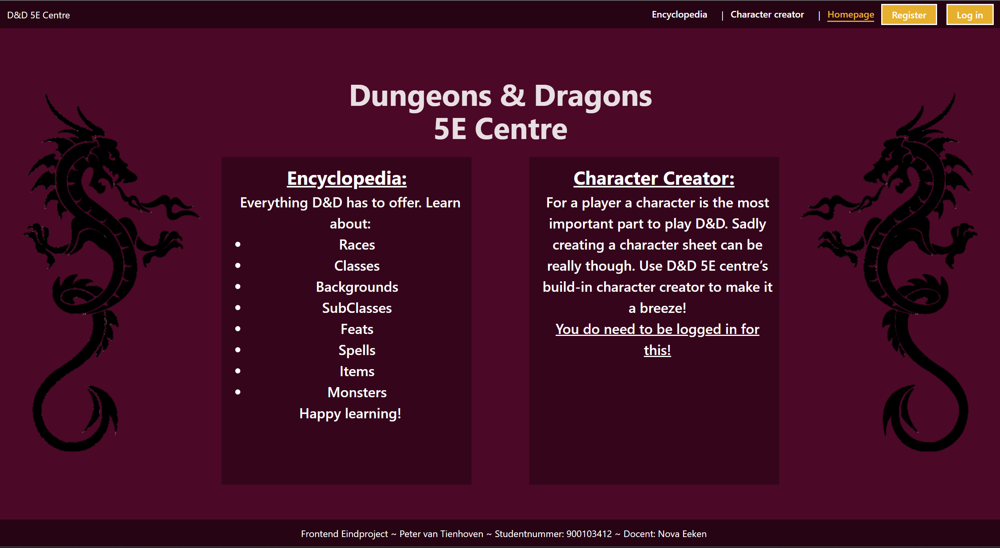

# 5E Centre Installation Guide

## Index
* [Introduction](#introduction)
* [System Requirements](#system-requirements)
* [Installation Guide](#installation-guide)

### Introduction

Dear user,

Welcome to 5e Centre. The place for you to find information on D&D 5th edition information.

This project is made as an exam for my education.
This project helps you to create a character and also works as an encyclopedia.

### System Requirements

This should be able to run on most PCs or laptops. It has specifically been made for Chrome, but it should work for every modern browser.

### Installation Guide
1. You need to be able to use React+Vite and JavaScript, so an IDE is necessary to run this project. It has been built in [Webstorm](https://www.jetbrains.com/webstorm/), so I suggest using Webstorm.
2. Make sure you have Node.js installed: [Download Node.js](https://nodejs.org/en/download). Without this, we can't run Vite. You can check if this is done by typing in your terminal: `node`
3. Go to the repository's GitHub page: [5E Centre GitHub Repository](https://github.com/Tenoven/Eindopdracht_frontend_02-2024)
4. Click the green "Code" button
5. Choose the "Download ZIP" option
6. Unzip the zipped file
7. Place this unzipped file wherever you want on your PC, making sure your IDE can find it
8. Open the project in your IDE
9. In your IDE's terminal, enter: `npm install`
10. When that is done, type: `npm run dev`
11. Now click on the following link and you should be on the site: [http://localhost:5173/](http://localhost:5173/)

If you run into any issues, please contact me through GitHub.
